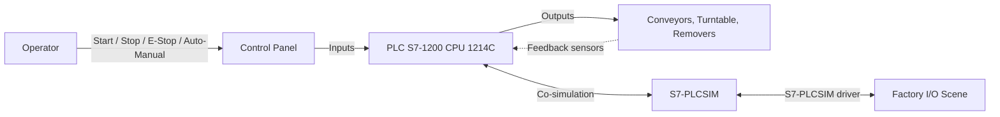

# Architecture Diagram

High level architecture of the sorting line project.

## Overview

## Layers

### Layer 1 - Operator interface

- Start pushbutton (NO)
- Stop pushbutton (NC)
- Reset pushbutton (NO)
- Emergency stop (2 NC contacts)
- Auto / Manual selector (2 contacts)
- Green, yellow, red indicators and pushbutton lamps
- Counter display (integer)

### Layer 2 - PLC program

- `OB1` Main
- `FC9000` link with S7-PLCSIM
- `FB_ModeManager` modes and safety
- `FB_SortingLogic` sorting sequence
- `FC_Outputs` single writer of all outputs
- `FB_Kpi` embedded performance indicators
- `DB_Machine` global state
- `UDT_ActuatorCmd` actuator command type

### Layer 3 - Simulation

- S7-PLCSIM runs the PLC program
- Factory I/O renders the 3D scene and the sensors
- The Siemens S7-PLCSIM driver links PLCSIM and Factory I/O
- The on-board I/O of the CPU is moved to start address 100 so it does not overlap the process image written by Factory I/O

### Layer 4 - Physical model

- Feeder conveyor
- Entry conveyor
- Turntable with rollers
- Left exit conveyor
- Right exit conveyor
- Remover left and remover right
- Light curtain, position sensors, entry and exit sensors

## Data flow

1. Operator selects Auto mode and presses Start.
2. The PLC runs the sequence: step 1 emits a box.
3. The box crosses the light curtain, height is latched.
4. The box reaches the turntable, is centered, the turntable rotates.
5. The box is dispatched to the left or right exit conveyor, depending on its height.
6. The box is counted on the rising edge of the end sensor of its lane.
7. The next box is emitted as soon as the previous one has left the turntable.

