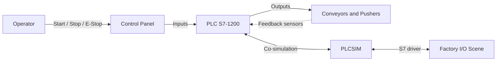

# Architecture Diagram

High level architecture of the sorting line project.

## Overview

## Layers

### Layer 1 - Operator interface

- Start button
- Stop button
- Emergency stop
- Mode selector (auto or manual)
- Green and red lights

### Layer 2 - PLC program

- OB1 Main
- FB1 Gestion_Modes
- FB2 Logique_Tri
- FC1 Affectation_IO

### Layer 3 - Simulation

- PLCSIM runs the PLC program
- Factory I/O renders the 3D scene and the sensors
- The S7 driver links PLCSIM and Factory I/O

### Layer 4 - Physical model

- Main conveyor
- Lane 1 conveyor
- Lane 2 conveyor
- Pusher 1
- Pusher 2
- Sensors

## Data flow

1. Operator presses Start
2. PLC starts the main conveyor
3. Box is detected by the entry sensor
4. Size sensors classify the box
5. Pusher is activated for the correct lane
6. Evacuation sensor increments the counter
