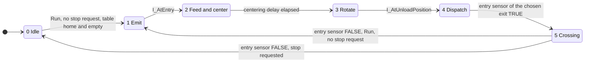

# Sorting sequence

The PLC sorts boxes one after the other. It emits a box, measures its height at the light curtain, centers it on the turntable, rotates the table, pushes the box to an exit conveyor and counts it at the exit sensor. The next box is emitted as soon as the previous one has left the turntable.

## Routing rule

| Box | `I_HighBox` seen | Roller command | Destination |
| --- | --- | --- | --- |
| Low | No | `Load` | Left conveyor |
| High | Yes | `Unload` | Right conveyor |

A high box always triggers both beams (see scene-behavior.md, E03), so the rule only needs `I_HighBox`. A box that triggers no beam is treated as Low.

## Grafcet

## Steps and actions

| Step | Name | Actions while the step is active |
| --- | --- | --- |
| 0 | Idle | None |
| 1 | Emit | `Emit` pulse of 500 ms, `FeederConveyor`, `EntryConveyor` |
| 2 | Feed and center | `FeederConveyor`, `EntryConveyor`, `Load`. A latch remembers that `I_AtTurntableEntry` was seen, then the delay `CenterTime` (default 2 s) runs. |
| 3 | Rotate | `Turn` |
| 4 | Dispatch | `Turn` plus the roller command of the routing table |
| 5 | Crossing | Same as step 4 |

Other actions:

- `LeftConveyor` and `RightConveyor` run whenever `Run` is TRUE.
- `RemoverLeft` and `RemoverRight` stay TRUE in Auto (default value of the command bits).
- The height latch and the entry seen latch are cleared in step 1 and can be set in step 2.

## Transitions

| From | To | Condition |
| --- | --- | --- |
| 0 | 1 | `Run`, no stop request, `I_AtLoadPosition`, no box on the turntable |
| 1 | 2 | `I_AtEntry` |
| 2 | 3 | Centering delay elapsed |
| 3 | 4 | `I_AtUnloadPosition` |
| 4 | 5 | Entry sensor of the chosen exit is TRUE |
| 5 | 1 | Entry sensor of the chosen exit is FALSE, `Run`, no stop request |
| 5 | 0 | Entry sensor of the chosen exit is FALSE, stop requested |
| any | 0 | `Run` is FALSE |

The two transitions leaving step 5 are evaluated last in the scan, so that only one transition happens per scan.

## Pipelining and turntable protection

The turntable returns home on its own when `Turn` is released at the transition 5 to 1. The new box is already emitted while the table is moving. To avoid pushing a box onto a table that is not home, `FeederConveyor` and `EntryConveyor` run in steps 1 and 2 only if no box is at `I_AtFront` or the table is at `I_AtLoadPosition`. A box that arrives early waits in front of the turntable.

## Exit counting and boxes in transit

A box is counted on the rising edge of the active level of its exit sensor, which depends on the sensor wiring and is set by `DB_Machine.ExitIdleHigh` (see scene-behavior.md, E09 and E10).

Several boxes can be on the same exit conveyor. Each exit has a counter of boxes in transit: it is incremented on the rising edge of the entry sensor of the exit (`I_AtLeftEntry` or `I_AtRightEntry`), decremented on the exit count (never below 0) and cleared when `Run` drops.

## Stop and fault behavior

- Stop: no new box is emitted. The box in progress is finished and counted. `CycleIdle` becomes TRUE when the step is 0 and both exits have no box in transit. `FB_ModeManager` then drops `Run`.
- Emergency stop or mode change: `Run` drops, the sequence returns to step 0, the boxes-in-transit counters are cleared and all commands are cleared.
- A box left on the turntable blocks the next cycle. Clear it in Manual mode.

## Known limitations

- Only one box between the emitter and the turntable at a time.
- No watchdog timers: a missing sensor signal stalls the sequence at the current step.
- `I_LowBox` and `I_AtBack` are mapped but not used by the logic.

## Performance

| Version | Time for 10 boxes (s) | Throughput (boxes per hour) |
| --- | --- | --- |
| One box at a time | 303 | 119 |
| Pipelined emission | 250 | 144 |
