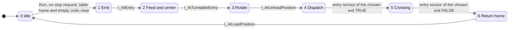

# Sorting sequence

The PLC sorts one box at a time. It emits a box, measures its height at the light curtain, centers it on the turntable, rotates the table, pushes the box to the left or right exit conveyor, returns the table home and counts the box at the exit sensor.

## Routing rule

| Box | `I_HighBox` during transit | Destination | Lane | Counter |
| --- | --- | --- | --- | --- |
| Low | Not seen | Left conveyor | 1 | `CountLeft` |
| High | Seen | Right conveyor | 2 | `CountRight` |

A high box always triggers both beams (see scene-behavior.md, E03), so the rule only needs `I_HighBox`. A box that triggers no beam is treated as Low.

## Grafcet

## Steps and actions

| Step | Name | Actions while the step is active |
| --- | --- | --- |
| 0 | Idle | None |
| 1 | Emit | `Emit` pulse of 500 ms, `FeederConveyor`, `EntryConveyor` |
| 2 | Feed and center | `FeederConveyor`, `EntryConveyor`, `Load` (the rollers draw the box in) |
| 3 | Rotate | `Turn` |
| 4 | Dispatch | `Turn`, then `Unload` for a Low box or `Load` for a High box |
| 5 | Crossing | Same as step 4 |
| 6 | Return home | None (releasing `Turn` brings the table back) |

Other actions:

- `LeftConveyor` and `RightConveyor` run whenever `Run` is TRUE.
- `RemoverLeft` and `RemoverRight` stay TRUE in Auto (default value of the command bits).
- The height latch is set when `I_HighBox` is TRUE during steps 1 and 2 and cleared in step 0.

## Transitions

| From | To | Condition |
| --- | --- | --- |
| 0 | 1 | `Run`, no stop request, `I_AtLoadPosition`, no box on the turntable, no box in transit on an exit conveyor |
| 1 | 2 | `I_AtEntry` |
| 2 | 3 | `I_AtTurntableEntry` |
| 3 | 4 | `I_AtUnloadPosition` |
| 4 | 5 | Entry sensor of the chosen exit is TRUE (`I_AtLeftEntry` for Low, `I_AtRightEntry` for High) |
| 5 | 6 | Entry sensor of the chosen exit is FALSE |
| 6 | 0 | `I_AtLoadPosition` |
| any | 0 | `Run` is FALSE |

## Exit counting

A box is counted on the rising edge of the active level of its exit sensor. The active level depends on the sensor wiring and is set by `DB_Machine.ExitIdleHigh` (see scene-behavior.md, E09 and E10). The count also clears the "in transit" flag of that exit, which allows the next cycle.

## Stop and fault behavior

- Stop: no new cycle starts. The current box is finished and counted, then `CycleIdle` becomes TRUE and `FB_ModeManager` drops `Run`.
- Emergency stop or mode change: `Run` drops, the sequence returns to step 0 and all commands are cleared.
- A box left on the turntable blocks the next cycle. Clear it in Manual mode.

## Known limitations

- One box at a time, no pipelining.
- No watchdog timers: a missing sensor signal stalls the sequence at the current step.
- `I_LowBox`, `I_AtBack` and `I_AtFront` are mapped but not used by the logic.