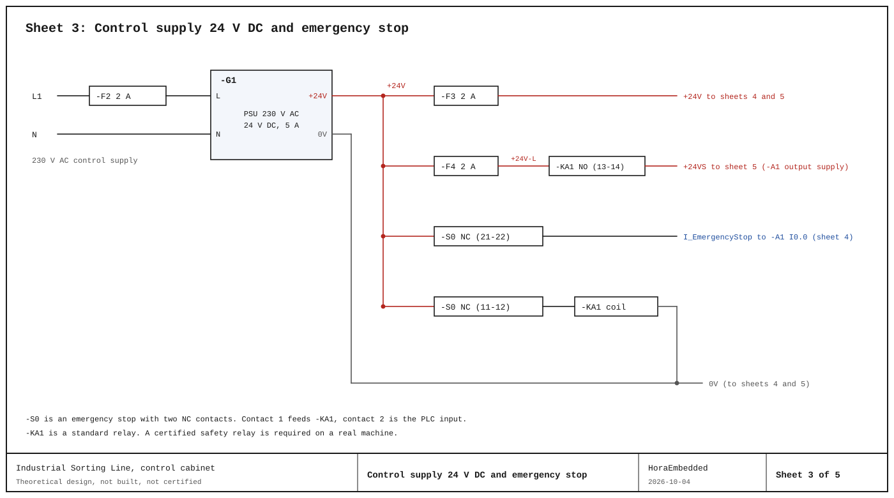
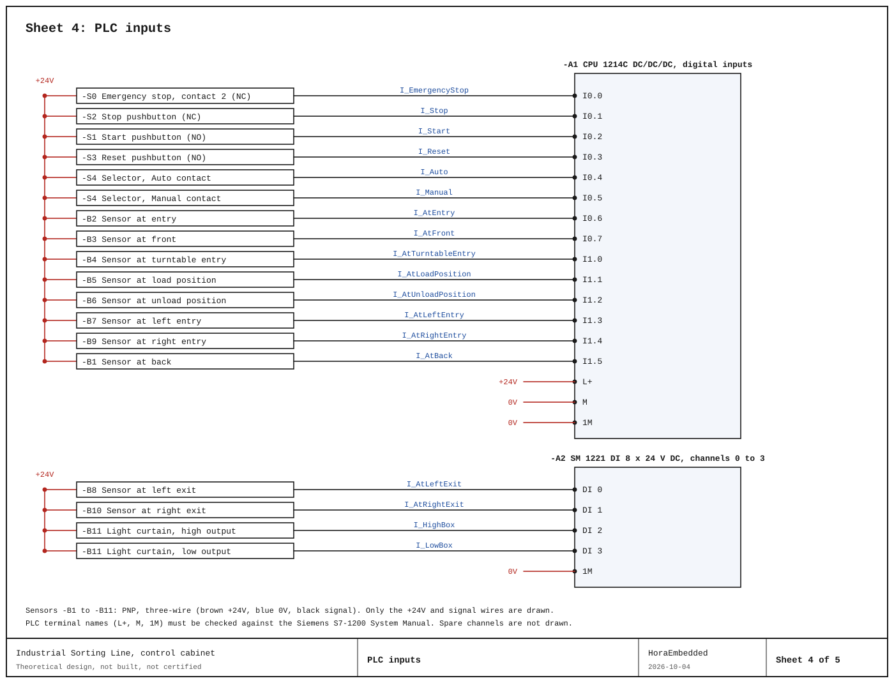
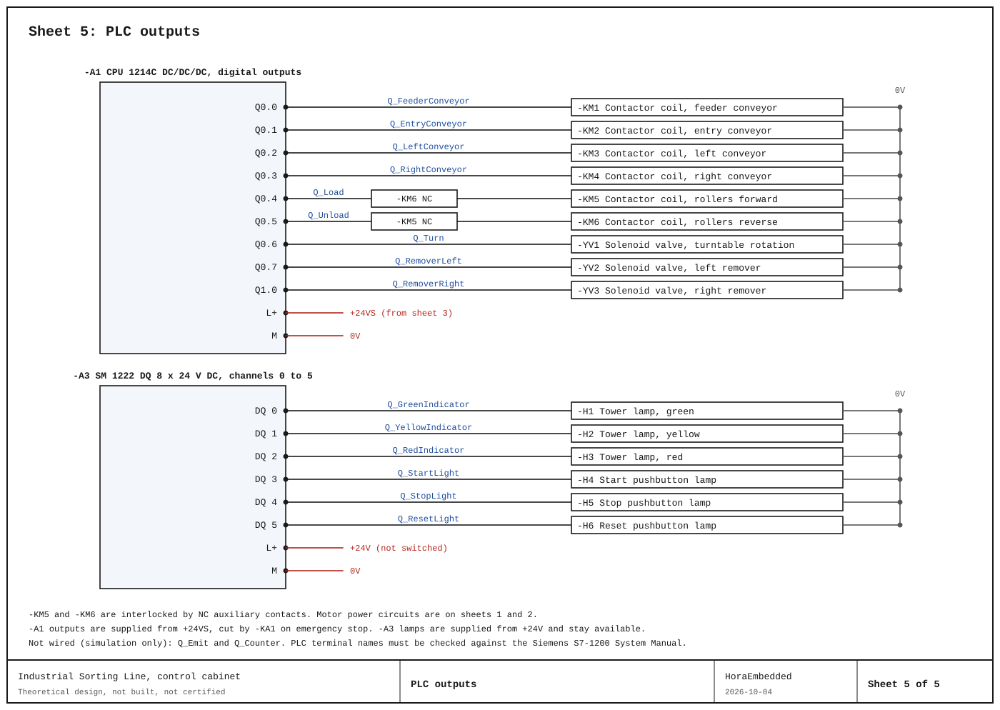

# Electrical schematics

Theoretical wiring diagram of the control cabinet of the sorting line (Siemens S7-1200, CPU 1214C DC/DC/DC with one DI and one DQ signal module).

## Contents

- `industrial-sorting-line.qet`: QElectroTech project (sheets 1 and 2, motor circuits)
- `motor-power.pdf`: PDF export of sheets 1 and 2
- `wiring-supply.svg`, `wiring-inputs.svg`, `wiring-outputs.svg`: sheets 3 to 5, generated by `scripts/generate_wiring.py`
- `plc-wiring.pdf`: PDF of sheets 3 to 5
- Design basis, assumptions, device list and I/O assignment: [docs/en/electrical-design.md](../docs/en/electrical-design.md)

## Sheets

| Sheet | Title |
| --- | --- |
| 1 | Main supply and motor starters M1 to M4 |
| 2 | Turntable roller motor M5 (reversing) |
| 3 | Control supply 24 V DC and emergency stop |
| 4 | PLC inputs |
| 5 | PLC outputs |

## Preview

## Notes

The design is theoretical. It is not built and it is not a certified safety design. The PLC tag addresses on real hardware differ from the simulation addresses, see the design basis.